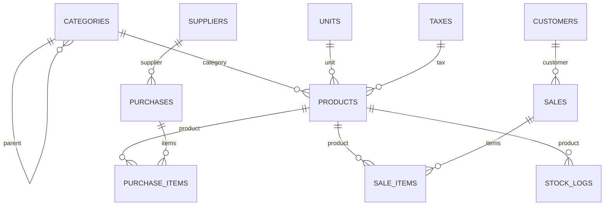

# Mini ERP System

A modern, responsive Enterprise Resource Planning (ERP) application built with **Laravel 11**, **PHP 8.3**, and **Bootstrap 5**. Designed for inventory management, purchase order handling, point-of-sale barcode scanning, batch-level stock tracking, automated audit logs, and asynchronous order notifications.

---

## Key Modules & Features

### 1. Purchase Order Management
- **Auto-Generated Invoice Numbers**: Automatically creates month-based purchase invoice numbers (e.g., `SEP001`, `SEP002`) via `CodeGeneratorService`.
- **Batch Barcode Generation**: Automatically generates unique item barcodes (e.g., `BC001`, `BC002`) for each purchase line item.
- **Batch Stock Allocation**: Tracks available stock per purchase item batch (`stock_quantity`) and increments overall product stock.
- **Stock Audit Logging**: Records `+` mode stock logs in `stock_logs` linking the purchase ID, purchase item ID, and supplier ID.
- **Detailed Purchase Cards**: Provides invoice headers, line-item breakdowns, tax calculations, and total amount summaries.

### 2. Sales & Barcode Scanning (POS)
- **Barcode Lookup (AJAX)**: Scanning a purchase item barcode (`/sales/scan/{code}`) instantly retrieves product details, SKU, selling price, and tax rate via AJAX.
- **Auto-Generated Sale Invoices**: Month-based sale invoice numbers (`SEP001`, `SEP002`...) generated automatically.
- **Batch Stock Deduction**: Deducts stock from specific `PurchaseItem` batches based on scanned barcode or FIFO order, alongside decrementing overall `Product` stock.
- **Stock Audit Logging**: Records `-` mode stock logs in `stock_logs` referencing the sale ID, sale item ID, and customer ID.
- **Payment & Order Statuses**: Manages payment methods (`Cash`, `UPI`, `Credit Card`, `Bank Transfer`), payment statuses (`Paid`, `Pending`, `Partial`), and order statuses (`Completed`, `Pending`, `Cancelled`).
- **Stock Restoration**: Editing or deleting a sale automatically restores batch and product stock levels.

### 3. Asynchronous Order Notification System
- **Queued Job Processing**: `SendOrderNotificationJob` runs via Laravel Queued Jobs (`database` driver) to log order events without blocking HTTP request cycles.
- **Notification Service**: `OrderNotificationService` formats templates for order events (`created`, `updated`, `completed`, `cancelled`).
- **Audit Logging**: Asynchronously logs notifications to Laravel log storage (`Log::info`).

### 4. Master Data Management
- **Hierarchical Categories**: Parent categories and subcategories (e.g., *Electronics* $\rightarrow$ *Mobile Phones*).
- **Units of Measurement**: Standardized measurement units (`pcs`, `kg`, `g`, `L`, `box`, `pkt`, `set`, `pair`, `mtr`).
- **Tax Slabs**: Flexible tax rates (`Exempt 0%`, `GST 5%`, `GST 12%`, `GST 18%`, `GST 28%`).
- **Customers & Suppliers**: Master directories with relationship deletion safeguards (prevents deleting items linked to active sales or purchases).
- **Product Catalog**: Products defined with SKU, category, subcategory, unit, tax rate, purchase price, selling price, and zero initial stock.

---

## Tech Stack

- **Backend Framework**: Laravel 11 / PHP 8.3
- **Database**: MySQL / SQLite
- **Frontend**: Blade Templates, Vanilla CSS, Bootstrap 5.3, Bootstrap Icons
- **Queue Driver**: Database Queued Jobs (`queue:work`)
- **Code Style**: Laravel Pint (`vendor/bin/pint`)
- **Test Runner**: PHPUnit (60 unit & feature test cases)

---

## Database Schema Overview



### Primary Database Tables
| Table | Description |
| :--- | :--- |
| `categories` | Product categories and subcategories (`parent_id`) |
| `units` | Measurement unit definitions (`name`, `short_name`) |
| `taxes` | Tax slabs (`name`, `rate`) |
| `customers` | Customer directory (`name`, `email`, `phone`, `address`) |
| `suppliers` | Supplier directory (`name`, `email`, `phone`, `address`) |
| `products` | Product catalog with overall stock (`stock_quantity`) |
| `purchases` | Purchase headers (`purchase_number`, `purchased_at`, `total_amount`) |
| `purchase_items` | Purchase line items with batch barcode & stock (`barcode`, `stock_quantity`) |
| `sales` | Sale headers (`invoice_number`, `sold_at`, `status`, `total_amount`) |
| `sale_items` | Sale line items linked to purchase barcodes (`barcode`, `line_total`) |
| `stock_logs` | Audit trail for stock changes (`area`, `mode`, `quantity`, `ref_1..3`) |

---

## Getting Started

### Prerequisites
- PHP $\ge$ 8.3
- Composer $\ge$ 2.0
- MySQL or SQLite

### Installation Steps

1. **Clone the Repository**:
   ```bash
   git clone <repository-url>
   cd mini-erp-system
   ```

2. **Install Composer Dependencies**:
   ```bash
   composer install
   ```

3. **Configure Environment Variables**:
   Copy `.env.example` to `.env`:
   ```bash
   cp .env.example .env
   ```
   Set your database credentials in `.env`:
   ```ini
   DB_CONNECTION=mysql
   DB_HOST=127.0.0.1
   DB_PORT=3306
   DB_DATABASE=erp-system
   DB_USERNAME=root
   DB_PASSWORD=
   ```

4. **Generate Application Key**:
   ```bash
   php artisan key:generate
   ```

5. **Run Database Migrations & Seeders**:
   ```bash
   php artisan migrate:fresh --seed
   ```
   *Note: Seeders populate realistic master data, sample purchase orders, sales transactions, and stock logs using idempotent `firstOrCreate`/`updateOrCreate` inserts.*

6. **Start the Application Server**:
   ```bash
   php artisan serve
   ```
   Access the web interface at `http://localhost:8000`.

7. **Start the Queue Worker** *(for Async Notifications)*:
   ```bash
   php artisan queue:work
   ```

---

## Running Tests

The application includes unit and feature test coverage for all modules, barcode lookup, batch stock deduction, and order notifications.

Run the test suite with PHPUnit:
```bash
php artisan test
```

---

## License

This project is licensed under the MIT License.
